# Functional Specification

📖 Table of content

- [Functional Specification](#functional-specification)
  - [I. Document](#i-document)
    - [A. Information](#a-information)
    - [B. History](#b-history)
    - [C. Documents](#c-documents)
  - [II. Project Overview](#ii-project-overview)
    - [A. Purpose](#a-purpose)
    - [B. What is a Serious Game](#b-what-is-a-serious-game)
  - [III. Requirements](#iii-requirements)
    - [A. Story](#a-story)
    - [B. Prototype features](#b-prototype-features)
    - [C. Optional features](#c-optional-features)
  - [IV. Product](#iv-product)
    - [A. Game Mechanic](#a-game-mechanic)
      - [1. Movements](#1-movements)
      - [2. Utilities](#2-utilities)
      - [3. Quests](#3-quests)
      - [4. Teleportation](#4-teleportation)
    - [B. Interface](#b-interface)
    - [C. Success](#c-success)
    - [D. Personas and Scenarios](#d-personas-and-scenarios)
      - [1. Sarah](#1-sarah)
      - [2. Carl](#2-carl)
    - [E. Non-functional Requirements](#e-non-functional-requirements)
      - [1. cost](#1-cost)
        - [a. Assets](#a-assets)
        - [b. Time development](#b-time-development)
      - [2. Environment](#2-environment)
      - [3. Security](#3-security)
    - [F. Assumptions and Constraints](#f-assumptions-and-constraints)
  - [V. Risk](#v-risk)
    - [A. Competitors](#a-competitors)
    - [B. Product problem](#b-product-problem)
    - [C. Data](#c-data)
  - [Deadlines](#deadlines)
  - [Glossary](#glossary)

## I. Document

### A. Information

| Author | Grégory PAGNOUX |
| - | - |
| Creation date | 11/07/2024 |
| Last Modification | 11/22/2024 |
| Reviewer(s) | Léna DE GERMAIN / Mathis LEBEL |
| Last review | 11/22/2024 |

### B. History

| Version | Edits completed by | Date | Description of edit |
| - | - | - | - |
| 1.1 | Grégory PAGNOUX | 11/07/2024 | Create template,   [ProjectOverview](#ii-project-overview),   [Deadlines](#deadlines) |
| 1.2 | Grégory PAGNOUX | 11/12/2024 | [Requirements](#iii-requirements),   [Time development](#b-time-development),   [Environment](#2-environment),   [Glossary](#glossary) |
| 1.3 | Grégory PAGNOUX | 11/13/2024 | [Security](#3-security),   [Risk](#v-risk),   [Glossary](#glossary) |
| 1.4 | Grégory PAGNOUX | 11/19/2024 | rework on the concept,   new [competitors](#a-competitors),   [Personas](#d-personas-and-scenarios),   [Assumptions and constraints](#f-assumptions-and-constraints) |
| 1.5 | Grégory PAGNOUX | 11/20/2024 | flow charts for [Game Mechanic](#a-game-mechanic),   [Assests](#a-assets) |
| 1.6 | Grégory PAGNOUX | 11/21/2024 | [Interface](#b-interface),   finish [Assets](#a-assets) |
| 2.1 | Grégory PAGNOUX | 11/22/2024 | corrections of the first review |

### C. Documents

During the brainstorming phase, we split researches between us and the table with results is below:

- [Research table](https://docs.google.com/spreadsheets/d/18TqcBMzp2aJckCZGYooOq7OQtThMyXTudi9O38hkBC4/edit?usp=sharing)

You can find the One-sheet document below:

- [One-sheet](https://docs.google.com/document/d/153vc26EhVamXTxfOmKHst1HX5ckaABPQhl9MGn1WX2Y/edit?tab=t.0)

## II. Project Overview

### A. Purpose

The project was commissioned by ALGOSUP to create a "Serious Game" on the theme of global warming. The aim is to talk about the causes and solutions for combating this current phenomenon, which is having an ever-increasing impact on us.

### B. What is a Serious Game

A serious game (video game or board game) is a lovely match between serious, educational content and a video game's mechanics and storytelling. It's a tool incredibly efficient at communicating educational messages in an interactive, engaging, and federating way.

The term "serious game" has been used since the beginning of the twentieth century, and the best-known game is The Landlord's Game (predecessor of Monopoly) in 1903.

In the early 1990s, a number of games on this theme were released, followed by another spike to over 100 games a year and a third in 2007 with over 200 games.
These spikes are due to a growing awareness of the climate emergency, and there are no fewer than 2,000 different games on the subject.

Serious games are commonly used to educate, raise awareness, and develop critical thinking and problem-solving skills, as well as for therapeutic purposes.

Sources :

- [Wikipedia](https://en.wikipedia.org/wiki/Serious_game)
- [Collock](https://www.collock.com/en/serious-game/)
- [ResearchGate](https://www.researchgate.net/figure/Number-of-Serious-Games-released-each-year-2218-games_fig1_273693305#:~:text=As%20we%20consider%20that%202002,%25%20of%20our%20total%20...)

## III. Requirements

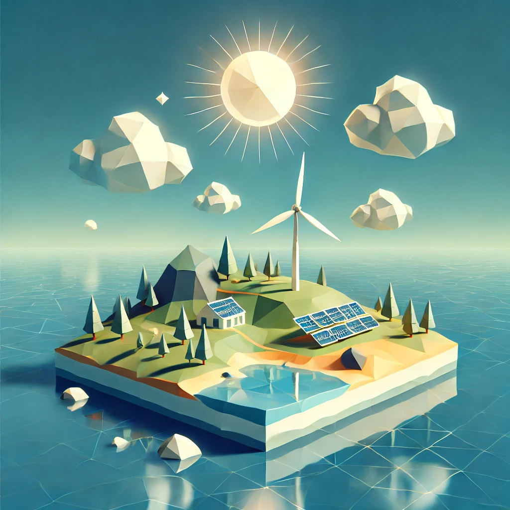

### A. Story

The Renewable Island is a serious game in which players take on the role of a character called Bob. He has just bought an old house, but the village mayor ordered him to renovate the house with renewable energies. How can he do that when he knows nothing about it?
You'll have to carry out missions all over the map to convert all fossil fuels to renewable energies and improve your house. As you carry out your first tasks, you learn that a book that can solve all the world's problems is hiding in the house.
Will you find it?

### B. Prototype features

To create our serious game, we need to have some basic features that we must have for the prototype:

- the ability to control the character's movement (move forward, backward, left, right, and jump)
- interactions with objects
- two different biomes (village and beach)
- three quests per biome
- inventory with drag and drop system

**Village**

The village has some houses and buildings where you can find the town hall, the library, a shop, and the museum.
The quests that you can complete on this place are:

- learn some techniques and new things on ecology
- measure air quality
- convert the energy of a factory (from fossil to renewable)

**Beach**

The beach is a part of the map where you can walk and swim to clean up and protect the ocean life.
The quests that you can complete on this place are:

- collecting plastic rubbish
- restoring coral reefs
- saving animals from the oil spill.

### C. Optional features

Here are all the optional features that we can find in the game after the prototype phase:

- teleportation between two spaces
- add biomes (forest, fields, mountain)
- add quests (until 10 per biome)
- the main house of the player (in the city)
- the story
- add bike to move on the map
- NPCs[^1], discussions and quests

**Village**

This quest can be added to the prototype:

- convince villagers to leave their cars and use a bike

**Forest**

The forest is a place where you can find animals and some locations where humans leave their footprints.
Some quests that you can complete on this place are:

- collecting plastic rubbish
- CO2 report
- preventing fire
- plant trees

**Fields**

There is a farm in the fields where you can help the farmer to cultivate, and take care of important natural resources.
The quests that you can complete on this place are:

- water filtration
- composting

**Mountain**

The mountain is a great spot to work on projects that help the environment, like using clean energy and protecting the land.
The quests that you can complete on this place are:

- renewable energy (solar or wind turbine)
- study glaciers
- measure air quality

## IV. Product

### A. Game Mechanic

#### 1. Movements

Here's how the player moves around the map:

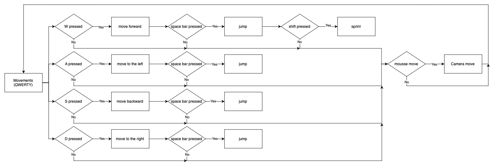

#### 2. Utilities

Here's how the player's interactions work in the game:

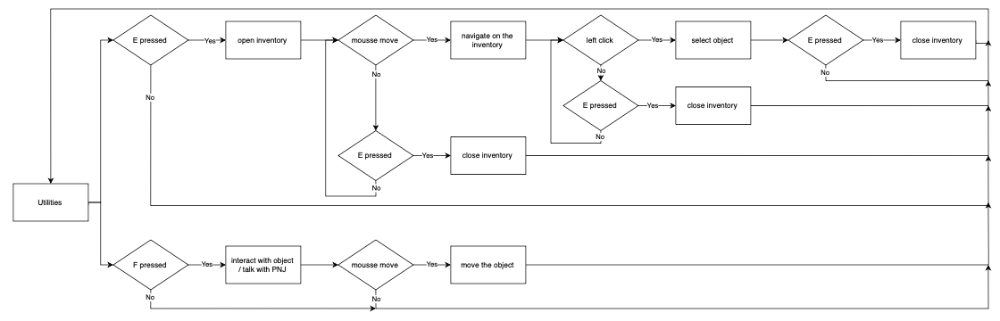

#### 3. Quests

Here's how the quests that players must complete in the game work:

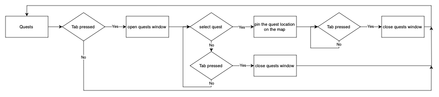

#### 4. Teleportation

Here's how the teleportation system works, so that players can move around the map more easily:

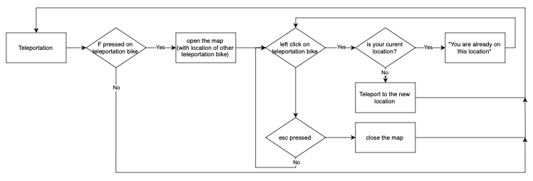

### B. Interface

**Home page**

When the player opens the game, the first open window is the Home page below.
Firstly, the player can modify some settings to adapt the game as he wants.
The second button is to begin a new game, mostly used for new players and those who have already finished the game.
The third button is to load the last part that the player has launched and saved. To be functional, the player needs to have started at least one game before.
The last one is to quit the game.

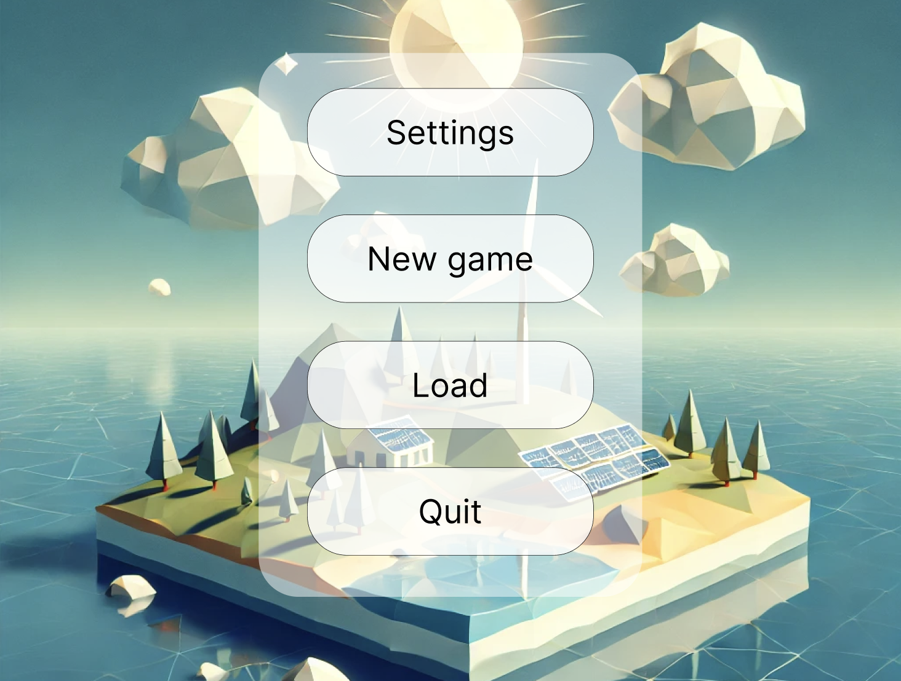

**Game screen**

When the player launches his game, he has the following interface :

- actual location on the map of the player (top left)
- energy evolution bar of the actual location (top left)
- quests table (left)
- mini-map, top view (top right)
- time (top right)

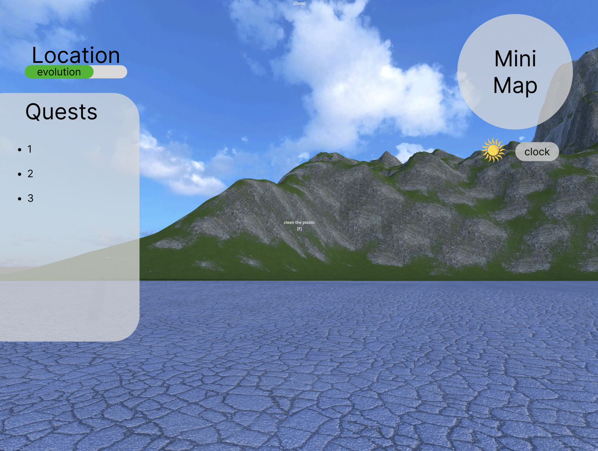

**Inventory**

When the player presses the "e" keyboard, the inventory opens. You can recover all objects you have on the left side and you can have the description and all details about the object on the right side when you pass the mousse on it.

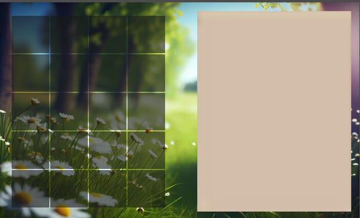

**Menu**

When the player launches his part, he can presse the "esc" keyboard and the menu window opens.
Firstly, the player can modify some settings to adapt the game as he wants.
The second button is to save his part. Thanks to that, the player quit the game and came back later thanks to the load button on the home page.
The last one is to quit the game.

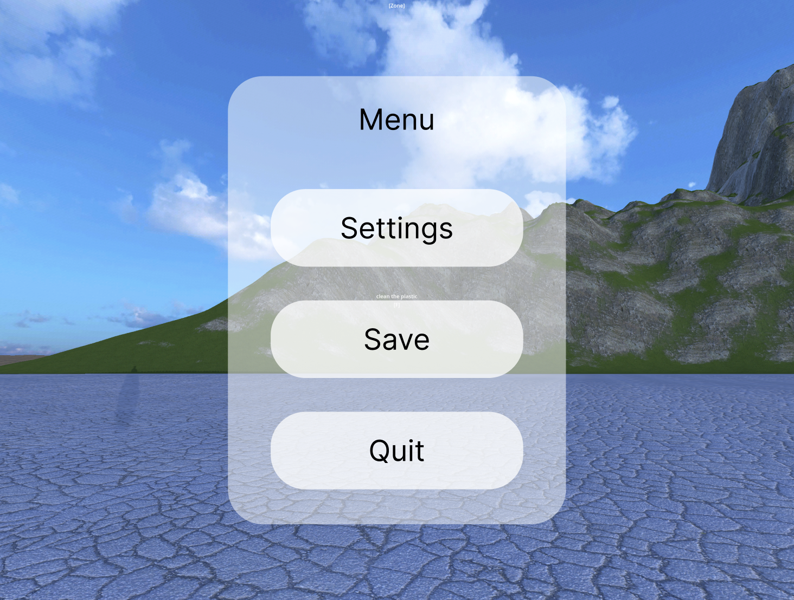

### C. Success

During the game, you can collect multiple successes like:

- you complete your first quest
- you complete 5 quests
- you complete 10 quests
- You entirely clean the village
- You entirely clean the beach

You can also collect data about climate change, Fossil fuels, and renewable energies.

### D. Personas and Scenarios

#### 1. Sarah

Sarah is 12 years old, with long, wavy blonde hair often tied up in a ponytail. She's small with an energetic presence, always moving and curious. She loves wearing colourful t-shirts with animal or nature-themed prints and comfortable sneakers for running around.
Sarah is full of enthusiasm and curiosity, always asking questions about the world around her. She's passionate about animals, the environment, and making sure the planet stays healthy. Sarah is very open-minded and loves learning new things, especially when it’s fun. She is sensitive to the environment and can get upset when she hears about pollution or climate change. She enjoys playing games that teach her new facts, solve problems, and involve adventure.

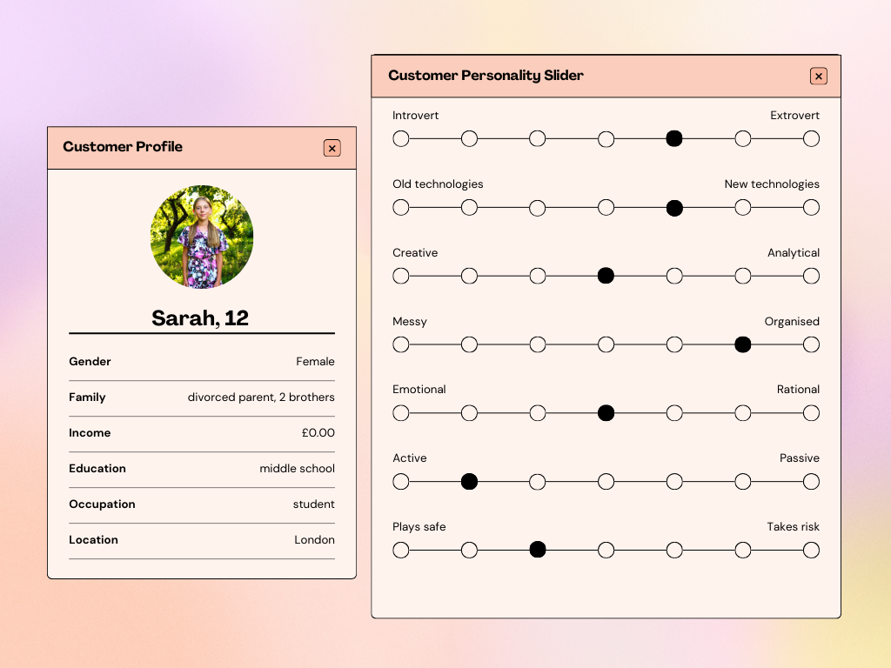

Sarah is a middle school student who loves to play outside and is fascinated by nature. She often spends her weekends visiting parks and taking care of the family's garden. She enjoys watching nature documentaries and reading books about animals and the planet.
Sarah is active on social media, where she follows environmental groups and shares eco-friendly tips with her friends. She often feels the urge to make a difference but isn't always sure how to take action.
Playing games like yours gives her a sense of empowerment, as she learns more about how she can help the environment while having fun.
Sarah is a perfect fit for our serious game because she has a natural interest in the environment but lacks in-depth knowledge about renewable energy and sustainability.
The game's engaging, interactive elements will captivate her attention while teaching important lessons about the climate crisis and how to make a difference. She will likely find the adventure and exploration of the game motivating, while the hands-on learning approach will help her understand complex concepts in a fun and digestible way.

#### 2. Carl

Carl is 35 years old, with short, dark hair and a slightly muscular build. He dresses casually, often wearing jeans and a T-shirt, and he prefers comfort over fashion. His facial expression is serious but often lights up with enthusiasm when discussing topics that interest him, especially technology and the environment.
Carl is a practical, hands-on person who values efficiency and progress. He's deeply concerned about the future of the planet but often feels overwhelmed by the magnitude of the problem. He is more of a problem-solver than an advocate and enjoys finding solutions rather than discussing the issues. Carl has a growing interest in renewable energy technologies and sees them as an opportunity for innovation. He enjoys games but prefers ones with clear goals and logical challenges.

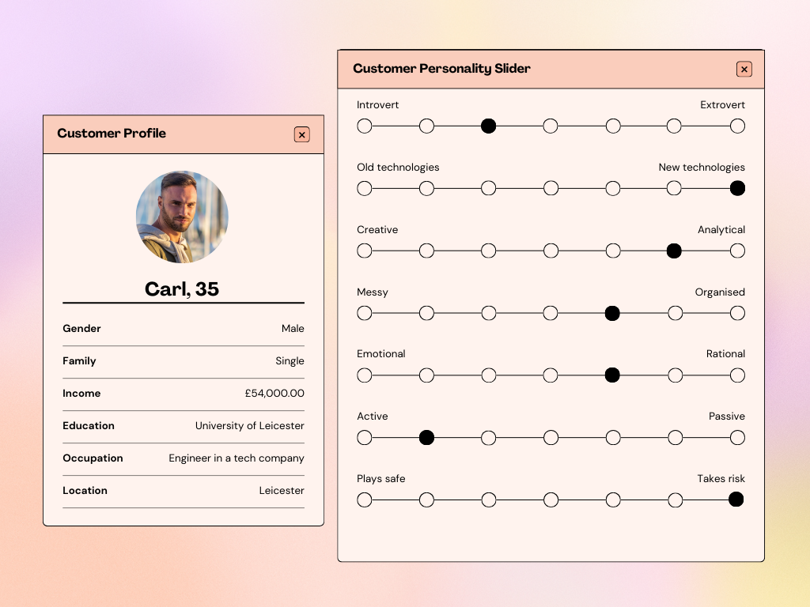

Carl works as an engineer in a tech company and is always looking for ways to improve systems and processes. He's not particularly active in environmental organizations, but his increasing interest in renewable energy and sustainable tech is growing.
He plays video games in his free time to unwind, but he appreciates games that challenge his problem-solving skills. He would be drawn to a game that not only teaches him about renewable energy but also offers practical, hands-on ways to make real-world change.
Carl is likely to appreciate the strategic and goal-oriented aspects of our serious game. His focus on solving problems and learning about new technologies aligns with the game's emphasis on converting fossil fuels into renewable energy.

The game will appeal to his desire for practical solutions to the climate crisis while engaging him in a way that feels both educational and rewarding.

### E. Non-functional Requirements

#### 1. cost

##### a. Assets

We design some objects of the game, but for time reasons, we use assets listed below:

| ASSETS | PRICE | PROTOTYPE | FINAL GAME | LINK |
| :-: | :-: | :-: | :-: | :-: |
| sounds | 0€ | No | Yes | [Universal SoundBank](https://www.universal-soundbank.com) |
| map textures | 0€ | Yes | Yes | [AmbientCG](https://ambientcg.com) |
| trees | 0€ | Yes | Yes | [itch.io](https://jaks.itch.io/lowpolyforestpack) |
| bushes and mushrooms | 0€ | Yes | Yes | [itch.io (city)](https://free-game-assets.itch.io/free-shrubs-flowers-and-mushrooms-3d-low-poly-pack),   [itch.io (farm)](https://quaternius.itch.io/lowpoly-farm-buildings) |
| buildings | 0€ | Yes | Yes | [Poly Pizza/](https://poly.pizza/u/Quaternius) |
| character and NPCs | 0€ | No | Yes | [itch.io](https://kaylousberg.itch.io/kaykit-adventurers) |
| animals | 0€ | No | Yes | [itch.io](https://davidoreilly.itch.io/everything-library-animals) |
| furnitures | 0€ | No | Yes | [itch.io](https://milkandbanana.itch.io/cooking-assets) |
| other objects | 0€ | No | Yes | [itch.io (bike)](https://psionicgames.itch.io/free-bmx-3d-model),   [itch.io (box and trash)](https://brokenvector.itch.io/low-poly-storage-pack) |
| **Total** | **0€** |  |  |  |

##### b. Time development

We have 61 hours and 45 minutes dedicated to developing the game.
This amount of time doesn't take into consideration any overtime that members can do during the project.

#### 2. Environment

- Visual Studio Code on documents
- Godot on development
- MacOS and Windows on development

#### 3. Security

- respect GDPR[^2] and data saving law
- ensure the integrity[^3] of the information given to the player about climate change

### F. Assumptions and Constraints

**Assumptions**

- Players will have access to a computer capable of running the game.
- The game will run without requiring specific hardware or installation prerequisites.
- Players are assumed to have access to a stable internet connection for downloading the game and updates.

**Constraints**

- Time and budget constraints may limit the scope of the initial prototype.
- The complexity of some features, like NPC interactions and additional biomes, may need to be simplified for the prototype phase.
- The game must be compatible with both Windows and MacOS, which may impose certain technical constraints.

## V. Risk

### A. Competitors

Today, serious games cover a lot of subjects and have a lot of competitors.
For our game, there are two other games partially cover the subject we're talking about and that could be potential indirect competitors.
The first one is Esperide and the second one is Nuage.

**Esperide**

You embody a forester, and you have one mission, save the French forest by making decisions and managing flora and fauna[^4].
This game is developed for the French Government and the ONF[^5] and has the Néo Terra label[^6].
The aim of this game is to experiment with different forest management methods adapted to tomorrow's climate and develop innovative awareness-raising tools to explain forest management to the general public.

Here you can find [Esperide](https://www.onf.fr/vivre-la-foret/%2B/12bd::entrez-au-coeur-des-enjeux-du-changement-climatique-et-sauvez-la-foret.html)

**Nuage**

Zeus is your name, you can control a city and help it to reduce pollution, and become an utopic city where it's a good place to live.
This game was developed by Hakatah[^7] whose aim is to help people understand the phenomenon of climate change and raise awareness of its consequences.

Here you can find [Nuage](https://www.serious-game.fr/nuage-le-serious-game-sur-le-changement-climatique/)

**Plan It Green The Big Switch**

The player takes on the role of mayor of his fictional city and attempts to build an urban environment that is energy efficient while still meeting the needs of its citizens. He earns money and decides how to spend it, using various energy-efficient technologies to expand and grow his city into the most eco-friendly city in the world.
Plan It Green: The Big Switch is an online, city-building simulation game that gives students the opportunity to make complex decisions about the role of green energy, energy conservation, and energy efficiency in a fictional city. Plan It Green: The Big Switch provides a unique opportunity for players to make decisions related to energy efficiency and energy sources and to see how those choices affect life in their city.

Here you can find the Guide of [Plan It Green The Big Switch](https://media.nationalgeographic.org/assets/file/Plan_It_Green_Educator_Guide_2.pdf)

### B. Product problem

We need to think about the problems our game may have, and the first thing to consider is the message it conveys. More specifically, the fact that the information we want to convey to the player is unclear or misunderstood could, in the worst-case scenario, lead to an adaptation of behaviour that would go against the climate and the very idea of the game.
The second is if our game is too big to install or requires specific handling to install, many potential players will not launch the game and the impact will be reduced or even non-existent.
The third problem is the risk of transmitting too much information through the game and therefore losing the educational and fun value of the game.

### C. Data

Our game doesn't need to save players' data, but if the game evolves and we need to save information, we need to be interested in the reglementation of data backups.
There are three different archives depending on the type of data :

- **Active database archiving** where data that are no longer useful to the enterprise (for example, data on job seekers to which they have not followed up) are deleted once the reason for the study has been completed (after a maximum of two years).
- **Intermediate archiving** where data are saved even after the purpose of data collection has been achieved as they are still of interest to the enterprise. The duration is set by the person responsible and must be relevant to its usefulness.
- **Final archiving** where data that remains of great interest in the future without an end date are saved, after an upstream check.

source :

- [CNIL](https://www.cnil.fr/fr/reglement-europeen-protection-donnees)

## Deadlines

| PURPOSE | CONCERNED | DATE |
| - | - | - |
| Functional Specification | Grégory PAGNOUX | 11/22/2024 |
| Design (map, object, building, etc) | Léna DE GERMAIN / Guillaume DESPAUX | 11/29/2024 |
| Technical Specification | Robin GOUMY | 11/29/2024 |
| Test Plan | Léna DE GERMAIN | 06/12/2024 |
| Code | Mattéo LEFIN / Alexis SANTOS | 13/12/2024 |
| User Manual | Guillaume DESPAUX | 13/12/2024 |

## Glossary

[^1]: **NPC**
Abbreviation for Non-Playable Character. It's a character in a computer game that is not controlled by someone playing the game.
source : [Cambridge dictionnary](https://dictionary.cambridge.org/fr/dictionnaire/anglais/npc)

[^2]: **GDPR**
Abbreviation for General Data Protection Regulation. It's a European Union regulation adopted on 27 April 2016. It's the reference text for personal data protection. It strengthens and unifies data protection for individuals within the European Union.
source : [Wikipedia](https://fr.wikipedia.org/wiki/Règlement_général_sur_la_protection_des_données)

[^3]: **integrity**
The quality of being whole and complete. It's the fact that information is certified as true and we can believe it.
source : [Cambridge dictionnary](https://dictionary.cambridge.org/fr/dictionnaire/anglais/integrity)

[^4]: **flora and fauna**
The flora and fauna of a place are its plants and animals.
source : [Cambridge dictionnary](https://dictionary.cambridge.org/fr/dictionnaire/anglais/flora-and-fauna)

[^5]: **ONF**
Abbreviation for Office National des Forêts. The organization was created in 1966 and has 5 fundamental missions: to develop wood resources, to act for the environment, to welcome the public to the forest, to prevent natural risks**,** and to offer tailor-made services.
source : [ONF](https://www.onf.fr/onf/connaitre-lonf/+/28::les-enjeux-valeurs-et-missions-de-lonf.html)

[^6]: **Néo Terra label**
Néo Terra was created in 2019 to develop the environmental transition of the Nouvelle-Aquitaine. Their objective: to accelerate change and support the process. Their ambitions: natural resources, solidarity, agriculture and food, the economy, mobility and habitats, health.
source : [Néo Terra](https://www.neo-terra.fr/quest-ce-que-neo-terra/)

[^7]: **Hakatah**
Hakatah is a collective of video game designers committed to global warming founded in 2014. They run educational workshops and organise Game Jams (the event at which Nuage was born).
source : [Hakatah](https://www.hakatah.com)
